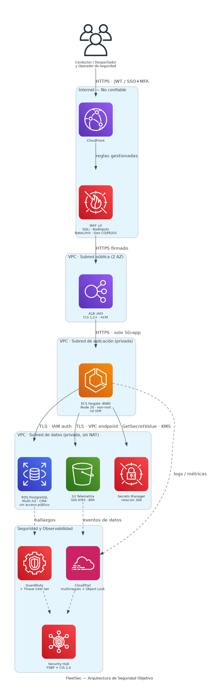
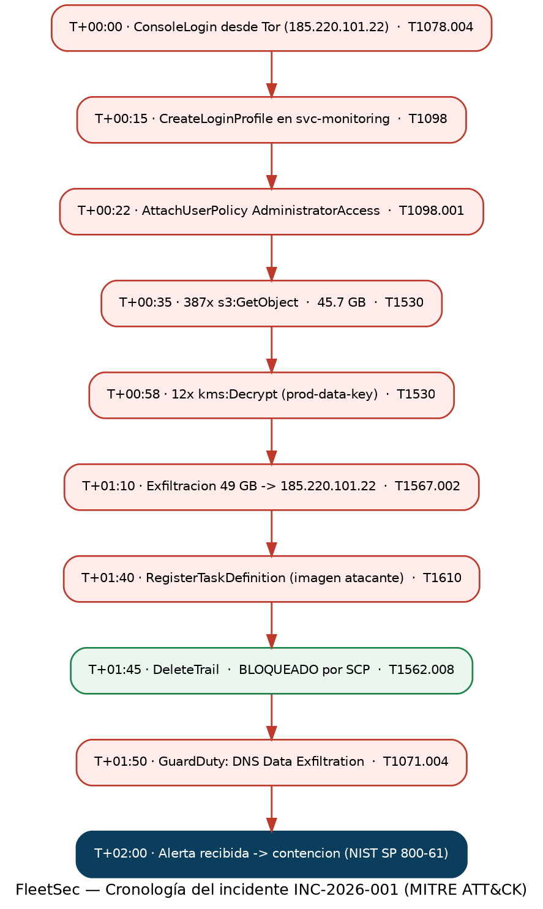
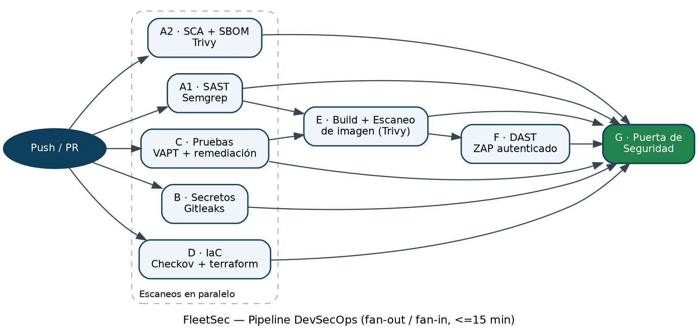

# FleetSec — Diagramas de Arquitectura de Seguridad

Autora: Lady Marcela Romero Rivero · Ingeniero de Ciberseguridad · Fecha: 2026-08-23 · Versión: 1.0

Los diagramas se entregan como imágenes renderizadas (PNG), generadas con la
librería `diagrams` (iconos oficiales de AWS) y Graphviz.

---

## 1. As-Is vs To-Be (postura de seguridad)

**Tabla 1.** Comparación del estado actual (sin programa de seguridad maduro) frente a la
línea base objetivo por dominio de control.

| Dominio | AS-IS (hoy, sin programa maduro) | TO-BE (línea base objetivo) |
|--------|----------------------------------|--------------------------|
| Identidad | Usuarios IAM, sin MFA, admin en cuentas de servicio | SSO + MFA, STS, rol por servicio, barreras SCP |
| Borde | Sin WAF, puerto 80/443 directo | CloudFront + WAF v2 (SQLi/bad-inputs/rate/geo) |
| Red | Plana, RDS público, SG 0.0.0.0/0 | VPC de 3 capas, subred de datos aislada, sin RDS público |
| Datos | AES-256 por defecto, BPA parcial | SSE-KMS CMK, BPA de cuenta, Object Lock en logs |
| Secretos | Codificados en el código fuente (V-10) | Secrets Manager, rotación de 30 días |
| Logging | Trail regional, sin validación, PII en logs | Trail multirregión + validación, enmascaramiento de PII |
| Detección | Ninguna | GuardDuty + Security Hub + reglas Sigma + Threat Intel Set |
| SDLC | Sin puertas de seguridad | Pipeline DevSecOps (SAST/SCA/DAST/IaC/secretos), ≤15 min |
| IR | Ad-hoc | Playbook NIST 800-61, mapeo MITRE, ruta a la SIC |

---

## 2. Arquitectura de seguridad objetivo (nivel contenedor, con fronteras de confianza)

**Figura 1.** Arquitectura objetivo desplegada en AWS. Cada agrupación representa una
**frontera de confianza**; cada flecha indica el protocolo y la autenticación del flujo.

**Fronteras de confianza (de mayor a menor exposición):**

1. **Internet — No confiable:** CloudFront + WAF v2 filtran todo el tráfico entrante
   (reglas gestionadas SQLi/BadInputs en BLOCK, rate limiting y geo-restricción CO/PE/US).
2. **Subred pública (2 AZ):** solo el ALB (TLS 1.2+, certificado ACM); su Security Group
   acepta 80/443 exclusivamente.
3. **Subred de aplicación (privada):** ECS Fargate (Node 20, contenedor non-root, rol IAM);
   solo acepta tráfico desde el Security Group del ALB.
4. **Subred de datos (privada, sin NAT):** RDS Multi-AZ cifrado con CMK y sin endpoint
   público, S3 con SSE-KMS y Block Public Access, y Secrets Manager. No tiene ruta a Internet.

**Clasificación de datos:** RDS y S3 contienen **PII sujeta a Ley 1581**; Secrets Manager
almacena **secretos**; los logs de CloudTrail son **evidencia de auditoría inmutable**
(Object Lock COMPLIANCE). Toda la telemetría de seguridad converge en Security Hub
(estándares FSBP + CIS AWS Foundations v1.4).

---

## 3. Flujo del incidente (brecha INC-2026-001)

**Figura 2.** Cadena de ataque reconstruida a partir de los indicadores embebidos, con la
técnica MITRE ATT&CK v14 correspondiente a cada paso. En verde, el control que **funcionó**
(la SCP que bloqueó el intento de borrado de CloudTrail).

El detalle de contención (AWS CLI exacto), el mapeo completo de técnicas, el análisis de
causa raíz y el resumen ejecutivo se encuentran en
`detection/playbooks/ir-playbook.md`.

---

## 4. Pipeline DevSecOps (fan-out / fan-in, ≤15 min)

**Figura 3.** Los jobs independientes se ejecutan en paralelo (fan-out) y convergen en la
Puerta de Seguridad (fan-in). El diseño en paralelo, con cachés de npm/Trivy, sostiene el
SLA de ≤15 minutos.

