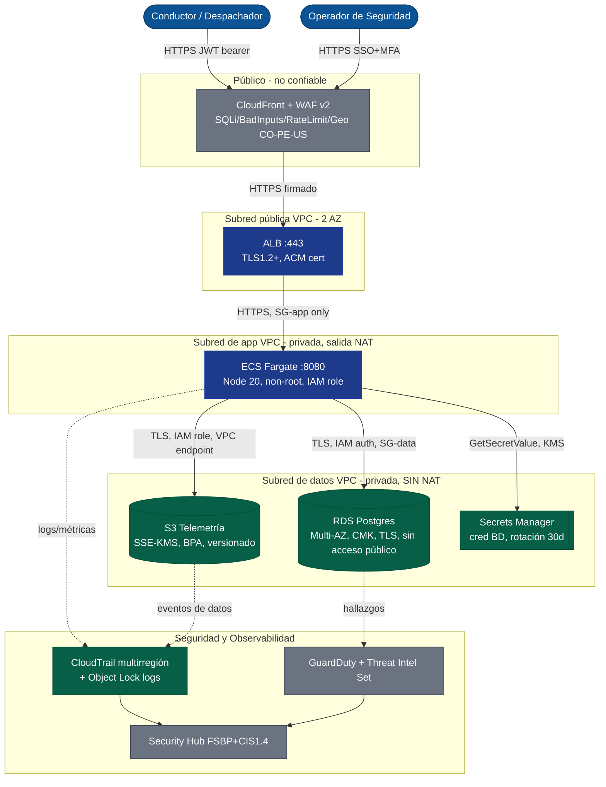
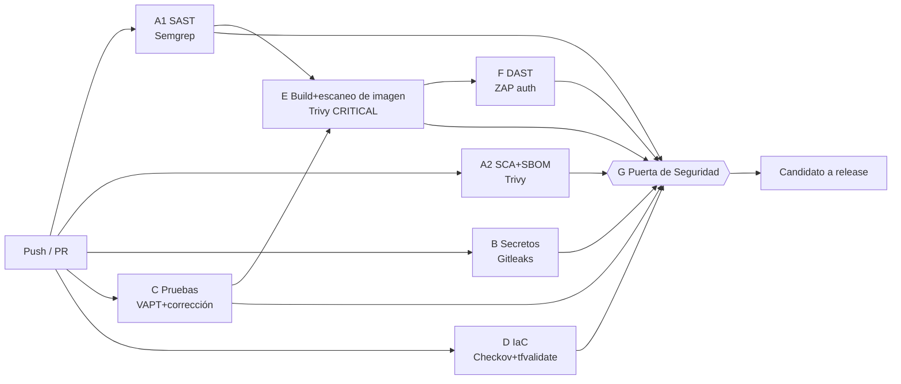

# FleetSec — Diagramas de Arquitectura de Seguridad

Autora: Lady Marcela Romero Rivero · Líder de Ciberseguridad · Fecha: 2026-08-23 · Versión: 1.0
Todos los diagramas se renderizan de forma nativa en GitHub (Mermaid). Para el artefacto
canónico en draw.io, importe el código Mermaid en draw.io: Arrange → Insert → Advanced → Mermaid.

---

## 1. As-Is vs To-Be (postura de seguridad)

| Dominio | AS-IS (hoy, sin programa maduro) | TO-BE (línea base objetivo) |
|--------|----------------------------------|--------------------------|
| Identidad | Usuarios IAM, sin MFA, admin en cuentas de servicio | SSO + MFA, STS, rol por servicio, barreras de protección SCP |
| Borde | Sin WAF, puerto 80/443 directo | CloudFront + WAF v2 (SQLi/bad-inputs/rate/geo) |
| Red | Plana, RDS público, SG 0.0.0.0/0 | VPC de 3 capas, subred de datos aislada, sin RDS público |
| Datos | AES-256 por defecto, BPA parcial | SSE-KMS CMC, BPA de cuenta, Object Lock en logs |
| Secretos | Codificados en el código fuente (V-10) | Secrets Manager, rotación de 30 días |
| Logging | Trail regional, sin validación, PII en logs | Trail multirregión + validación, enmascaramiento de PII |
| Detección | Ninguna | GuardDuty + Security Hub + reglas Sigma + threat-intel set |
| SDLC | Sin puertas de seguridad | Pipeline DevSecOps (SAST/SCA/DAST/IaC/secretos), ≤15 min |
| IR | Ad-hoc | Playbook NIST 800-61, mapeo MITRE, ruta a la SIC |

## 2. Arquitectura objetivo (C4 Container + fronteras de confianza)



**Fronteras de confianza:** TB1 internet→borde (WAF), TB2 borde→app (SG-app solo desde el ALB),
TB3→TB4 app→datos (SG-data 5432 solo desde SG-app; la subred de datos no tiene ruta a internet).

**Clasificación de datos:** RDS/S3 = **PII (Ley 1581)**; Secrets Manager = **secretos**;
logs de CloudTrail = **auditoría/inmutable**.

## 3. Flujo de datos del incidente (brecha INC-2026-001)

```mermaid
sequenceDiagram
    autonumber
    participant A as Atacante (185.220.101.22 / Tor)
    participant Con as Consola AWS
    participant IAM as IAM
    participant S3 as S3 fleetpay-prod-drivers
    participant KMS as KMS prod-data-key
    participant Net as VPC / Internet
    A->>Con: ConsoleLogin (credenciales válidas, sin MFA)  T+00:00
    Con->>IAM: CreateLoginProfile svc-monitoring  T+00:15
    A->>IAM: AttachUserPolicy AdministratorAccess  T+00:22
    A->>S3: 387x GetObject / 8min (45.7 GB)  T+00:35
    A->>KMS: 12x Decrypt  T+00:58
    A->>Net: 10.0.2.45 -> 185.220.101.22:443 (49 GB)  T+01:10
    A->>IAM: DeleteTrail  -- BLOQUEADO por SCP  T+01:45
    Note over A,Net: hallazgo de exfiltración DNS de GuardDuty T+01:50; alerta recibida T+02:00
```

## 4. Pipeline DevSecOps (fan-out / fan-in, ≤15 min)


