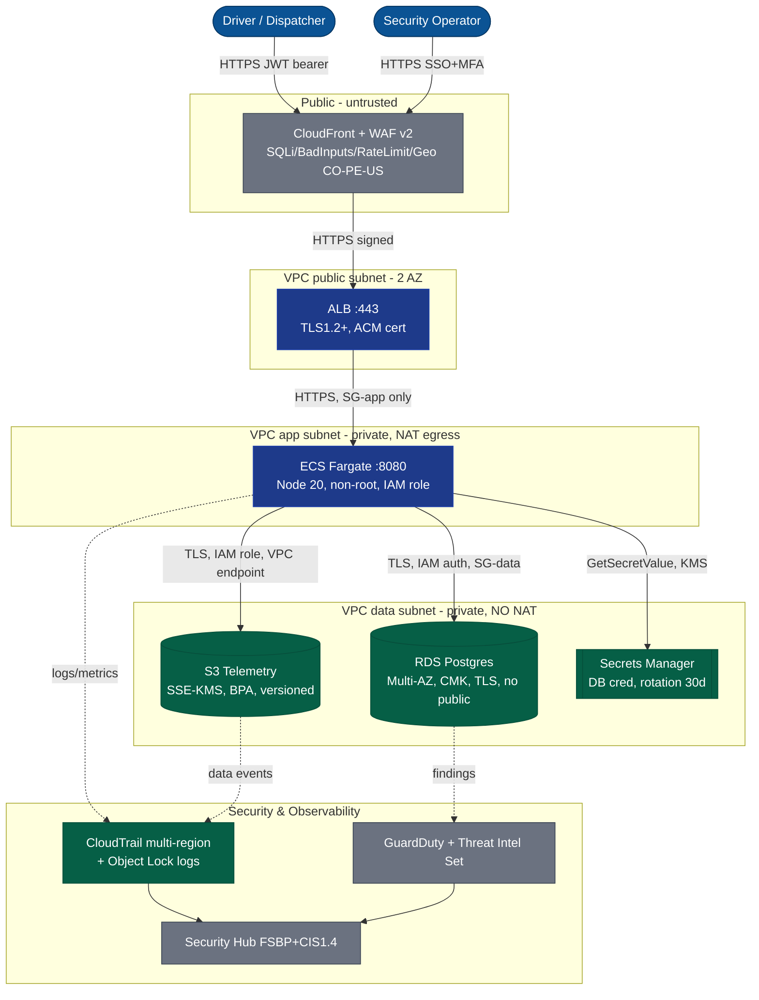
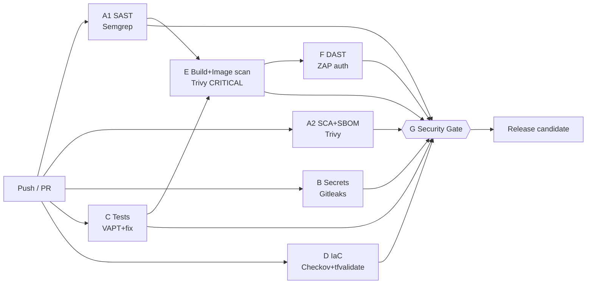

# FleetSec — Security Architecture Diagrams

Author: Security Engineering (candidate) · Date: 2026-08-23 · Version: 1.0
All diagrams render natively on GitHub (Mermaid). For the draw.io canonical artifact,
follow the step-by-step import guide in the video script (§ Instrucciones de Ejecución).

---

## 1. As-Is vs To-Be (security posture)

| Domain | AS-IS (today, no mature program) | TO-BE (target baseline) |
|--------|----------------------------------|--------------------------|
| Identity | IAM users, no MFA, admin on service accounts | SSO + MFA, STS, role-per-service, SCP guardrails |
| Edge | No WAF, port 80/443 direct | CloudFront + WAF v2 (SQLi/bad-inputs/rate/geo) |
| Network | Flat, public RDS, SG 0.0.0.0/0 | 3-tier VPC, isolated data subnet, no public RDS |
| Data | AES-256 default, partial BPA | SSE-KMS CMC, account BPA, Object Lock logs |
| Secrets | Hardcoded in source (V-10) | Secrets Manager, 30-day rotation |
| Logging | Regional trail, no validation, PII in logs | Multi-region trail + validation, PII masking |
| Detection | None | GuardDuty + Security Hub + Sigma rules + threat-intel set |
| SDLC | No security gates | DevSecOps pipeline (SAST/SCA/DAST/IaC/secrets), ≤15 min |
| IR | Ad-hoc | NIST 800-61 playbook, MITRE mapping, SIC path |

## 2. Target architecture (C4 Container + trust boundaries)



**Trust boundaries:** TB1 internet→edge (WAF), TB2 edge→app (SG-app from ALB only),
TB3→TB4 app→data (SG-data 5432 from SG-app only; data subnet has no internet route).

**Data classification:** RDS/S3 = **PII (Ley 1581)**; Secrets Manager = **secrets**;
CloudTrail logs = **audit/immutable**.

## 3. Incident data-flow (breach INC-2026-001)

```mermaid
sequenceDiagram
    autonumber
    participant A as Attacker (185.220.101.22 / Tor)
    participant Con as AWS Console
    participant IAM as IAM
    participant S3 as S3 fleetpay-prod-drivers
    participant KMS as KMS prod-data-key
    participant Net as VPC / Internet
    A->>Con: ConsoleLogin (valid creds, no MFA)  T+00:00
    Con->>IAM: CreateLoginProfile svc-monitoring  T+00:15
    A->>IAM: AttachUserPolicy AdministratorAccess  T+00:22
    A->>S3: 387x GetObject / 8min (45.7 GB)  T+00:35
    A->>KMS: 12x Decrypt  T+00:58
    A->>Net: 10.0.2.45 -> 185.220.101.22:443 (49 GB)  T+01:10
    A->>IAM: DeleteTrail  -- BLOCKED by SCP  T+01:45
    Note over A,Net: GuardDuty DNS exfil finding T+01:50; alert received T+02:00
```

## 4. DevSecOps pipeline (fan-out / fan-in, ≤15 min)


